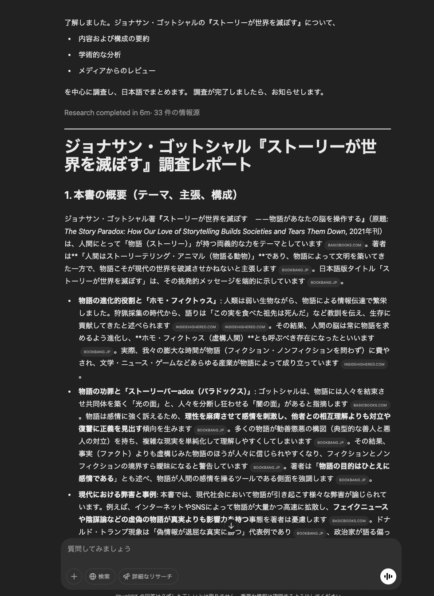
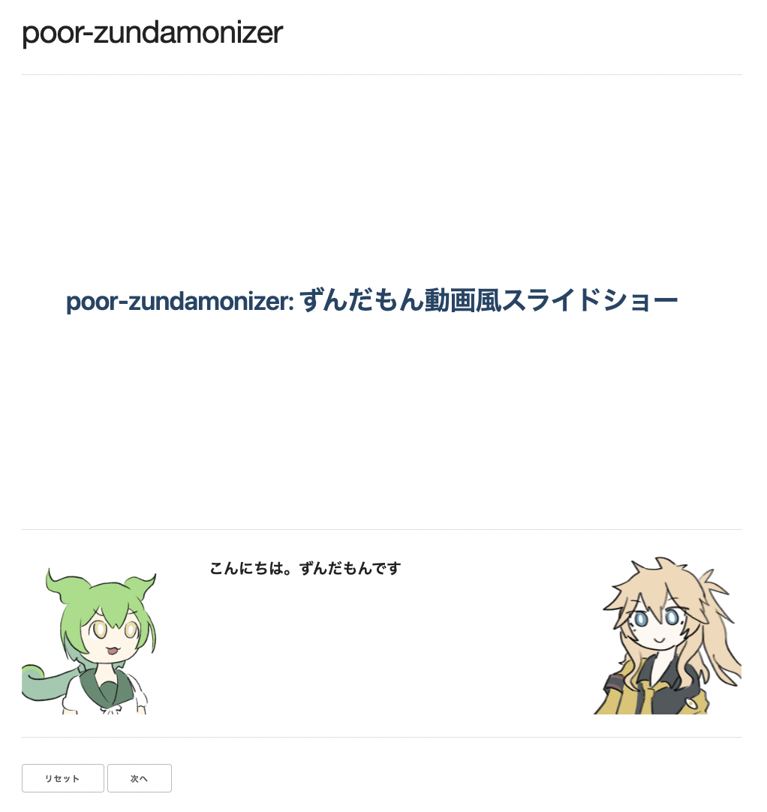

# poor-zundamonizer: ずんだもん動画風スライドショー

<!-- ずんだもん(neutral): こんにちは。ずんだもんです -->
<!-- ずんだもん(happy): 文章をずんだもないずするツール、プア・ずんだもないざーを紹介します -->
<!-- 春日部つむぎ(thinking): ずんだもないず、って何？ -->

---

# モチベーション

DeppResearch の文章を読むのすら面倒くさい。
こんなこと言ってごめんなさい。でも本音です。



<!-- ずんだもん(thinking): 最近、ディープリサーチなどのAIツールのおかげでまとまった情報にアクセスしやすくなっていますが、もうぶっちゃけ文章読むの面倒くさいっス -->
<!-- 春日部つむぎ(neutral): 堕落するのって簡単だね -->

---

# ほしいもの

ずんだもん動画になってくれんか。
バカな人間ですまん😫



<!-- ずんだもん(thinking): なので文章をずんだもん動画化、ずんだもないず、して大量の情報をさばきたい -->
<!-- 春日部つむぎ(happy): フォアグラの強制給餌みたいだね -->

---

# ほしいもの詳細

ずんだもん動画っていうか、

- 画面に簡潔に情報がまとまっている
- 詳細な情報が**別枠で**追加される

というのを期待しているかも。
自分のやりたいことがわかる賢い人間でよかった〜☺️

<!-- ずんだもん(happy): 持ち前の賢さで問題を単純化すると、スライドにキャラクターのお芝居を埋め込みたい、ということになるのだ -->
<!-- 春日部つむぎ(neutral): 賢い人間には必要なさそうな冗長化だよ -->

---

# ほしいもの設計案

<div style="display: grid; grid-template-columns: 1fr 1fr 1fr; gap: 2rem; border-radius: 8px;">

<div style="padding: 1rem; border-right: 1px solid #ccc;">

## こう言われる

<div style="text-align: center;">


</div>

</div>

<div style="padding: 1rem; border-right: 1px solid #ccc;">

## こうする

```markdown
## おいしいカレーの作り方

- 材料
  - 牛肉
  - 玉ねぎ
  - にんじん
  - パスタ

<!-- ずんだもん(neutral): ずんだもんだぜ！ -->
```

</div>

<div style="padding: 1rem;">

## こうなる

<div style="text-align: center;">


</div>

</div>
</div>

<!-- ずんだもん(neutral): して、期待としては、 AIがワーって言ってきた文章をスライドにし、それをナレーション付きで眺めたい -->

---

# 利用ツール

<div style="display: grid; grid-template-columns: 1fr 1fr 1fr; gap: 2rem; border-radius: 8px;">

<div style="padding: 1rem; border-right: 1px solid #ccc;">

## DeppResearch

人工知能が調べ物して
天然無能に教えてくれる
すごいやつだ

<div style="text-align: center;">


</div>

</div>

<div style="padding: 1rem; border-right: 1px solid #ccc;">

## Marp

スライドプレゼンを
Markdown で書ける
すごいやつだ

<div style="text-align: center;">


</div>

</div>

<div style="padding: 1rem;">

## VOICEVOX

文章を元に
音声を生成してくれる
すごいやつだ

<div style="text-align: center;">


</div>

</div>

</div>

<!-- ずんだもん(neutral): AIにたくさん文章を書かせたり、文章をスライドや音声にしたりする部分は、すごいツールがやってくれるんで、それらをうまく繋ぎ合わせていくのだ -->
<!-- 春日部つむぎ(angry): つまり創造性は発揮しないってことですか？ -->
<!-- ずんだもん(sad): お死になさい -->

---

# ずんだもナイザが使う部分

<div style="display: grid; grid-template-columns: 1fr 1fr 1fr; gap: 2rem; border-radius: 8px;">

<div style="padding: 1rem; border-right: 1px solid #ccc; opacity: 0.1;">

## DeppResearch

人工知能が調べ物して
天然無能に教えてくれる
すごいやつだ

<div style="text-align: center;">


</div>

</div>

<div style="padding: 1rem; border-right: 1px solid #ccc;">

## Marp

スライドプレゼンを
Markdown で書ける
すごいやつだ

<div style="text-align: center;">


</div>

</div>

<div style="padding: 1rem;">

## VOICEVOX

文章を元に
音声を生成してくれる
すごいやつだ

<div style="text-align: center;">


</div>

</div>

</div>

<!-- ずんだもん(neutral): ずんだもないざーでは、特にスライド・音声部分の繋ぎ合わせに焦点を当てておる -->
<!-- 春日部つむぎ(angry): さらに創造性を減らすおつもりか -->
<!-- ずんだもん(thinking): お静かに -->

---

# ずんだもナイザの利用

```sh
$ bun run index.ts <入力Markdownファイル> <出力ディレクトリ>
```

出力ディレクトリ内の `zundamonized.html` を開く。

<!-- ずんだもん(neutral): 利用時は、マークダウンファイルと出力先ディレクトリを指定する -->
<!-- 春日部つむぎ(thinking): 出力先はディレクトリなんだ -->

---

# ずんだもナイザがやること

1. Marp で Markdown を解釈し、HTML / CSS / コメントを取得
2. コメントを元に以下をやる:
   1. 音声ファイルの生成
   2. プレゼンテーション再生時のイベント生成
3. HTML / CSS / イベントを元にスライドショー用のページを生成

<!-- ずんだもん(neutral): 指定されたディレクトリの中に、スライドショー用のページとそのアセットを吐き出すという作りになっておる -->
<!-- 春日部つむぎ(happy): 取り回し重視、ですか -->
<!-- ずんだもん(thinking): なんか含みある？ -->

---

# ずんだもナイザがやることの詳細: コメントの処理


<!-- fit  -->
```typescript
    const { html, css, comments } = marp.render(`
    ## おいしいカレーの作り方

    カレーを作ろう

    <!-- ずんだもん(neutral): ずんだもんだぜ！ -->
    <!-- 春日部つむぎ(neutral): カレーよりタコライスがすき、春日部つむぎです -->

    ---

    ## おいしいタコライスの作り方

    カレーを作るのをやめよう

    <!-- ずんだもん(happy): おいしいタコライスを作ろう -->
    <!-- 春日部つむぎ(neutral): タコライスが好きとは言ったが、食べたいとは言っていない -->
    <!-- ずんだもん(angry): お死になさい -->
    `);

    // comments: [
    // ["ずんだもん(neutral): ずんだもんだぜ！", "春日部つむぎ(neutral): カレーよりタコライスがすき、春日部つむぎです"],
    // ["... コメントが続く ..."],
    // ]
```


<!-- ずんだもん(neutral): 具体的な処理としては、マジでマープが返すコメントを元に色々やってるだけなのだ -->
<!-- 春日部つむぎ(happy): オーマイガー、このコードつまんなすぎるよ -->
<!-- ずんだもん(sad): それは本当にそう -->

---

# まとめ

大したことをしていないので、
お好きに変更を加えてよしなに使ってね

<!-- ずんだもん(neutral): 良い面に目を向けると、拡張・カスタマイズが簡単という話はあるのだ-->
<!-- 春日部つむぎ(happy): 私が最強版を作って本家本元を名乗ろうと思うよ。お楽しみに -->
<!-- ずんだもん(thinking): お死になさい。それではみなさん、さようなら -->
